# Django Machine Learning Model Tracker

This is a sample project to show that you could keep track of your ML experiements using Django and Celery. We are using django celery results to store the results of the tasks. With the help of django rest framework, we are able to create a REST API to list the tasks and their results. We are also using flower to monitor the tasks.

**This is just a experiment not for production use.**

The project is based on the [Django Celery Template](https://open.vscode.dev/Joel-hanson/django-celery-template). The devcontainer library files are taken from the [vscode-dev-containers](https://github.com/microsoft/vscode-dev-containers) repository. More about devcontainers can be found [here](https://containers.dev/) and [here](https://github.com/devcontainers).

Tasks:
<!-- Tasks image -->
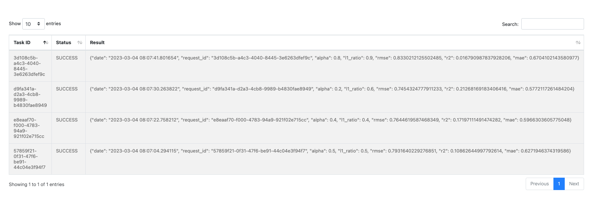

Experiments:
<!-- Results image -->
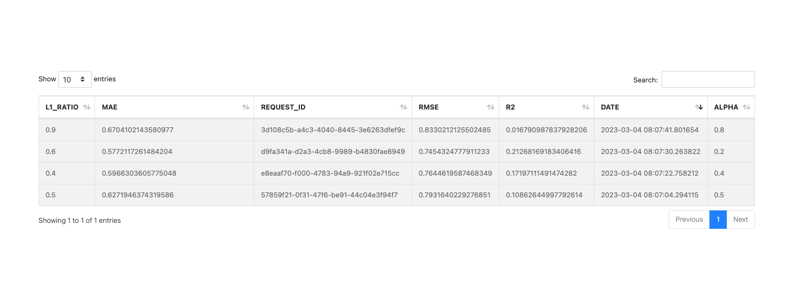

## Getting started

### Prerequisites

- [Docker](https://docs.docker.com/get-docker/)
- [Docker Compose](https://docs.docker.com/compose/install/)
- [Python 3.8](https://www.python.org/downloads/)
- [Django](https://www.djangoproject.com/download/)
- [Django Rest Framework](https://www.django-rest-framework.org/#installation)
- [Celery](https://docs.celeryproject.org/en/stable/getting-started/introduction.html)
- [PostgreSQL](https://www.postgresql.org/download/)
- [Redis](https://redis.io/download)
- [Flower](https://flower.readthedocs.io/en/latest/install.html)
- [Django Celery Results](https://django-celery-results.readthedocs.io/en/latest/installation.html)

### Running the project

#### Running with Docker Compose

1. Open the project in your terminal.
2. Run `docker-compose up` to start the project.

#### Running Django

1. Open the project in your terminal.
2. Run `python manage.py runserver` to start the project.

#### Running Celery

1. Open the project in your terminal.
2. Run `celery -A config worker -l info` to start the project.

## How to use (wine-quality example)

### Sample workflow - Running the wine-quality example

1. Visit the `/tasks` page.
  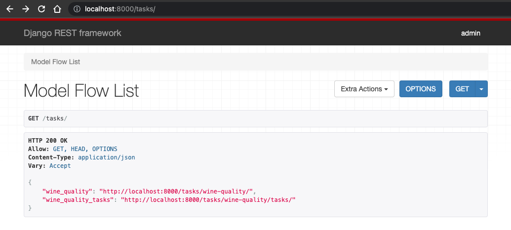
1. Click on the `wine_quality` link OR visit the `/tasks/wine-quality` page.
  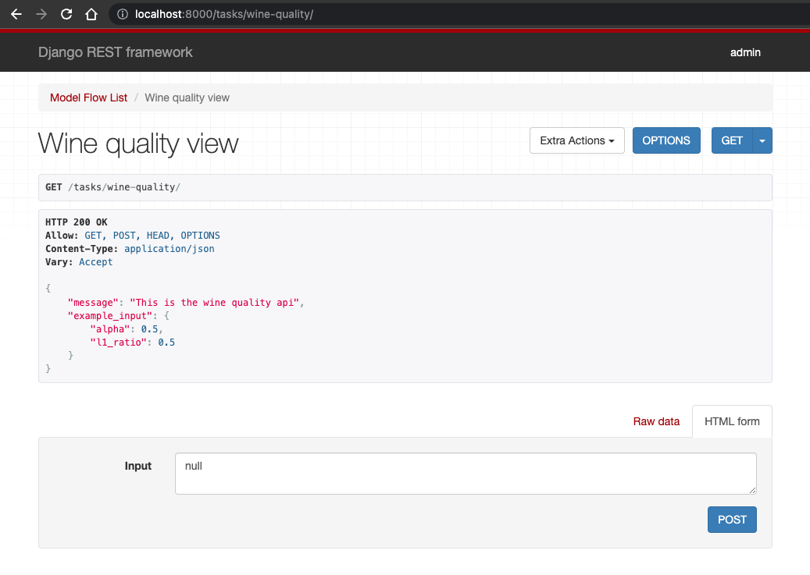
1. Fill out the form, provide the alpha and l1_ratio values. Click on the `POST` button.
  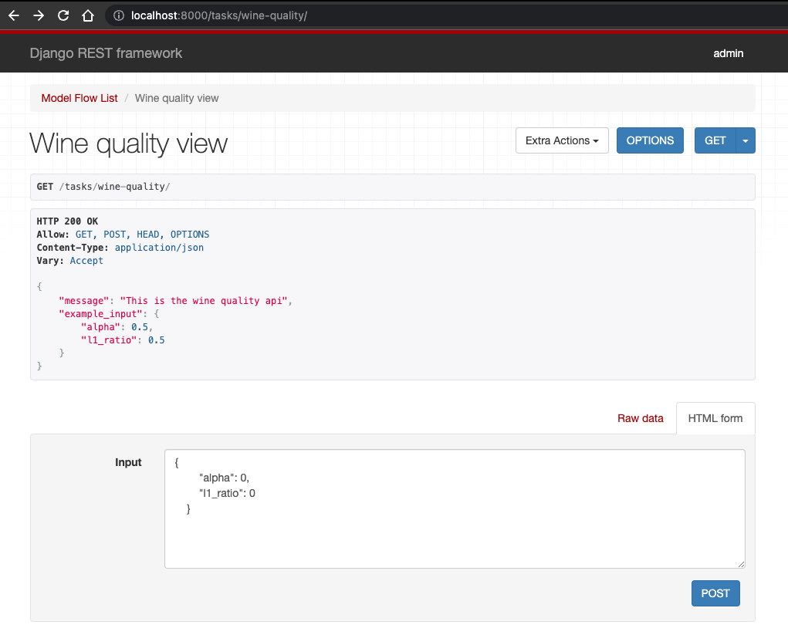
1. You should see a response with the task id and task url.
  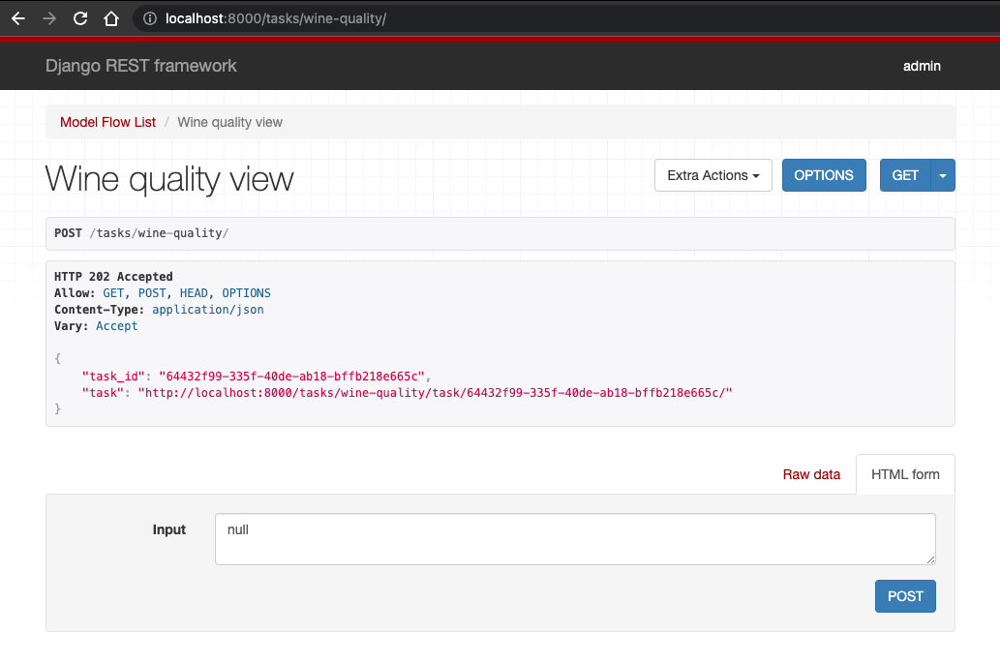
1. You can now visit the task url to see the task status and results.
  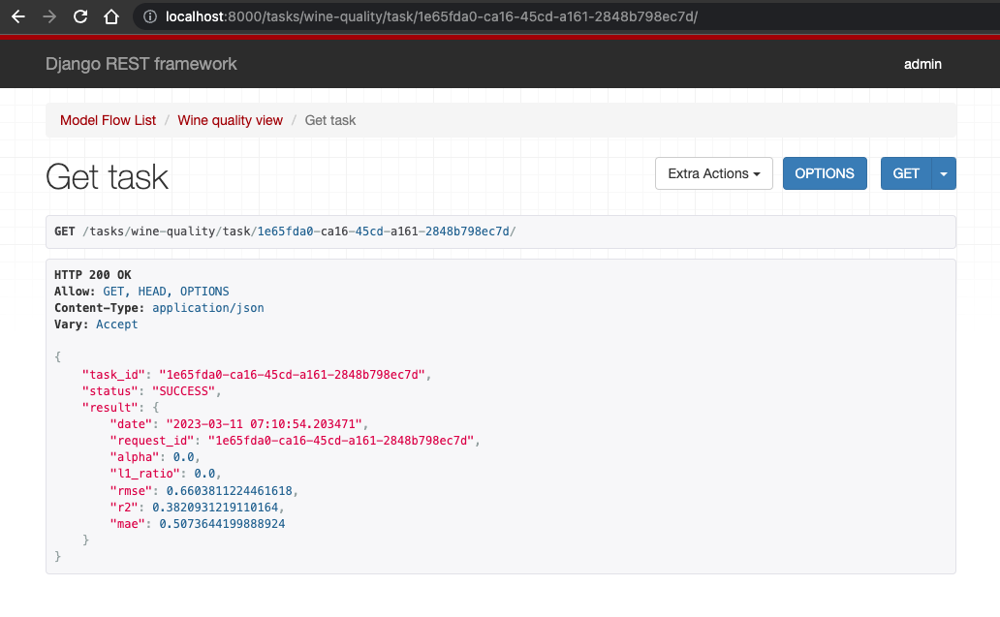

### Flower - Monitoring Celery

1. If you are running the project with Docker Compose, visit the `localhost:5566` page.
  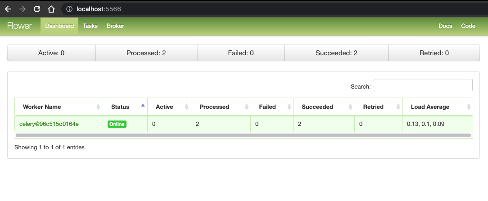
1. On clicking on the `Tasks` tab, you should see the tasks that have been run.
  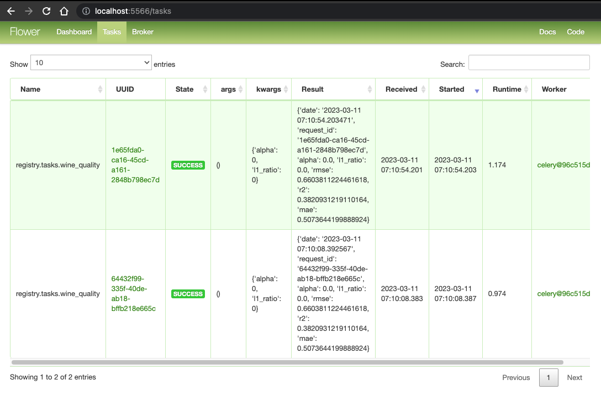
1. On cliking on one of the tasks, you should see the task details.
  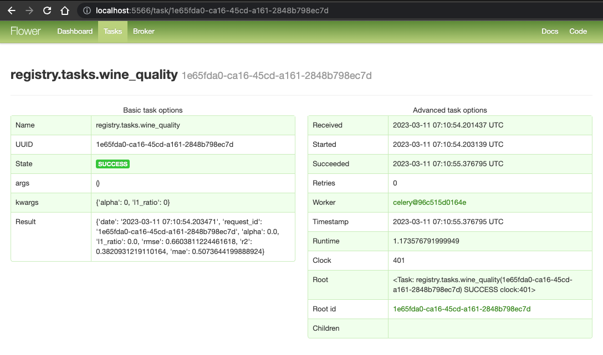

### Django Admin - Listing the tasks

1. If you are running the project with Docker Compose, visit the `localhost:8000/admin` page.
  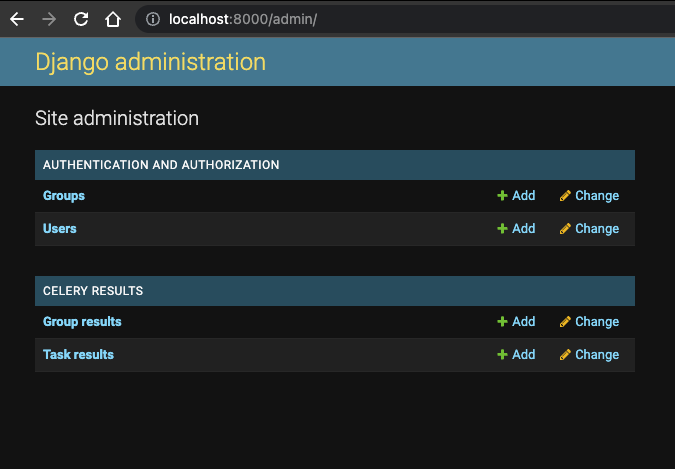
1. On clicking on the `Tasks` tab, you should see the tasks that have been run.
  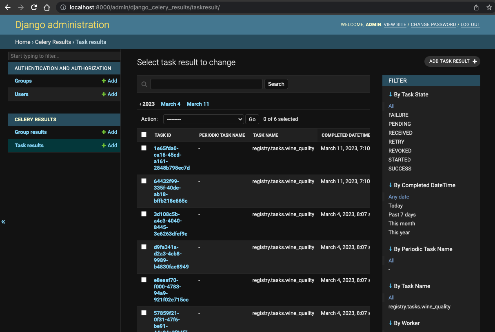
1. On cliking on one of the tasks, you should see the task details.
  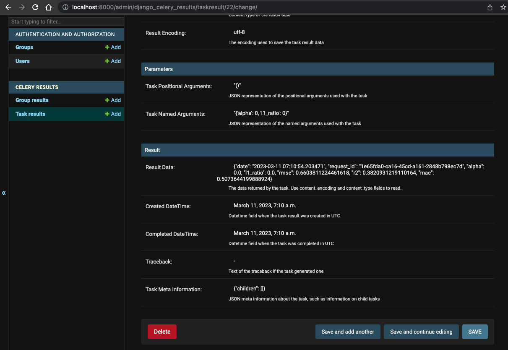

## Built With

- [Django](https://www.djangoproject.com/) - The web framework used for the backend
- [Celery](https://docs.celeryproject.org/en/stable/getting-started/introduction.html) - Asynchronous task queue/job queue based on distributed message passing
- [Docker](https://www.docker.com/) - Containerization platform
- [Docker Compose](https://docs.docker.com/compose/) - Tool for defining and running multi-container Docker applications
- [PostgreSQL](https://www.postgresql.org/) - Open source object-relational database system
- [Redis](https://redis.io/) - In-memory data structure store, used as a database, cache and message broker
- [Flower](https://flower.readthedocs.io/en/latest/) - Real-time monitor and web admin for Celery distributed task queue
- [Django Celery Results](https://django-celery-results.readthedocs.io/en/latest/) - Django application for storing Celery task results
- [Django Rest Framework](https://www.django-rest-framework.org/) - Powerful and flexible toolkit for building Web APIs

## Setting up the development container

### GitHub Codespaces

Follow these steps to open this sample in a Codespace:

1. Click the **Code** drop-down menu.
2. Click on the **Codespaces** tab.
3. Click **Create codespace on main** .

For more information on creating your codespace, visit the [GitHub documentation](https://docs.github.com/en/free-pro-team@latest/github/developing-online-with-codespaces/creating-a-codespace#creating-a-codespace).

### VS Code Dev Containers

If you already have VS Code and Docker installed, you can click the badge above or [here](https://vscode.dev/redirect?url=vscode://ms-vscode-remote.remote-containers/cloneInVolume?url=https://github.com/Joel-hanson/django-celery-template) to get started. Clicking these links will cause VS Code to automatically install the Dev Containers extension if needed, clone the source code into a container volume, and spin up a dev container for use.

Follow these steps to open this sample in a container using the VS Code Dev Containers extension:

1. If this is your first time using a development container, please ensure your system meets the prerequisites (i.e. have Docker installed) in the [getting started steps](https://aka.ms/vscode-remote/containers/getting-started).

2. To use this repository, you can either open the repository in an isolated Docker volume:

   - Press <kbd>F1</kbd> and select the **Dev Containers: Try a Sample...** command.
   - Choose the "Python" sample, wait for the container to start, and try things out!
     > **Note:** Under the hood, this will use the **Dev Containers: Clone Repository in Container Volume...** command to clone the source code in a Docker volume instead of the local filesystem. [Volumes](https://docs.docker.com/storage/volumes/) are the preferred mechanism for persisting container data.

   Or open a locally cloned copy of the code:

   - Clone this repository to your local filesystem.
   - Press <kbd>F1</kbd> and select the **Dev Containers: Open Folder in Container...** command.
   - Select the cloned copy of this folder, wait for the container to start, and try things out!
